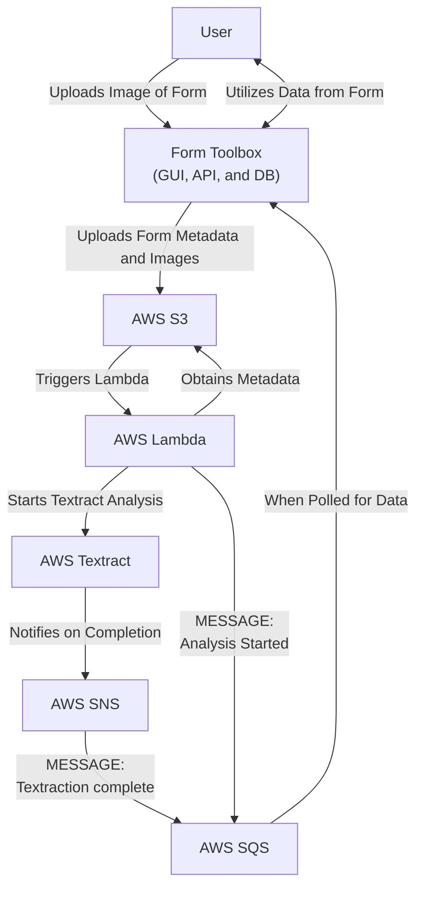
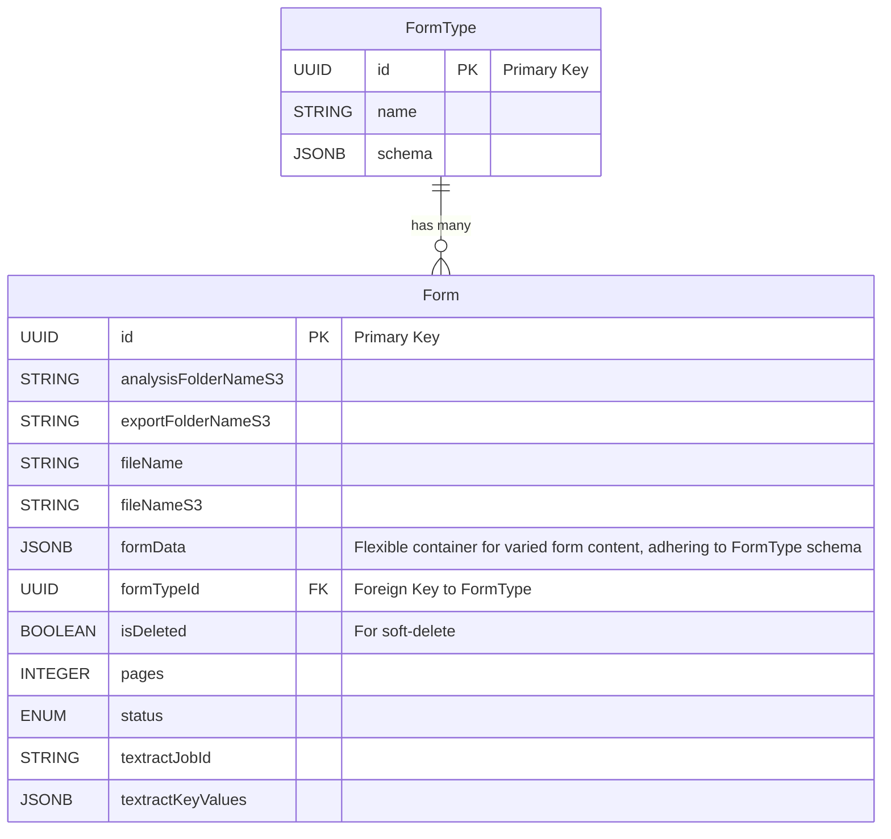

# form-toolbox

### Prerequisites

- AWS Account
- docker
- terraform

### 'Local' Development

To run a development build, which includes hot-reloading for the Docker portion:

1. `terraform -chdir=terraform validate`
1. `terraform -chdir=terraform plan`
1. `terraform -chdir=terraform apply`
1. `docker compose build`
1. `docker compose up -d`

When no longer needed, run:

1. `docker compose down`
1. `terraform -chdir=terraform destroy`

### Notes

- `AWS_SQS_REQUEUE_DELAY` is in seconds, not milliseconds
- `docker-compose.yaml` will eventually be renamed to `docker-compose-dev.yaml`. See `docker-compose.yaml` file for more details.

### AWS Integration Diagram

Form Toolbox utilizes AWS Textract to extract key-value data from forms.

### Database Diagram

To balance the diverse requirements of various form types with the need for strict schema and ACID compliance, Form Toolbox employs a hyrid approach. Utilizing PostgreSQL's JSONB datatype, we enable each form type to have its own schema, while still maintaining a consistent, overarching schema-based system. This methodology effectively merges the benefits of NoSQL/Document storage – flexibility and adaptability – with the strengths of a SQL/Schema-based system – reliability and structure. The result is a system that provides consistent document-style storage and retrieval within a structured SQL framework, catering to diverse form requirements while upholding data integrity and consistency.

