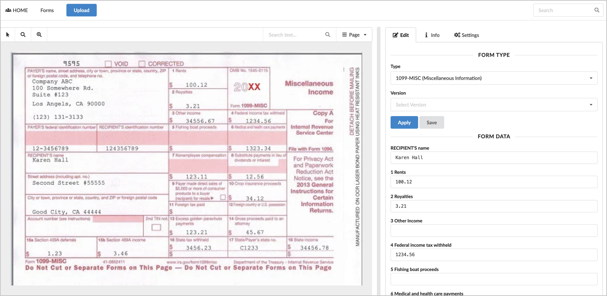
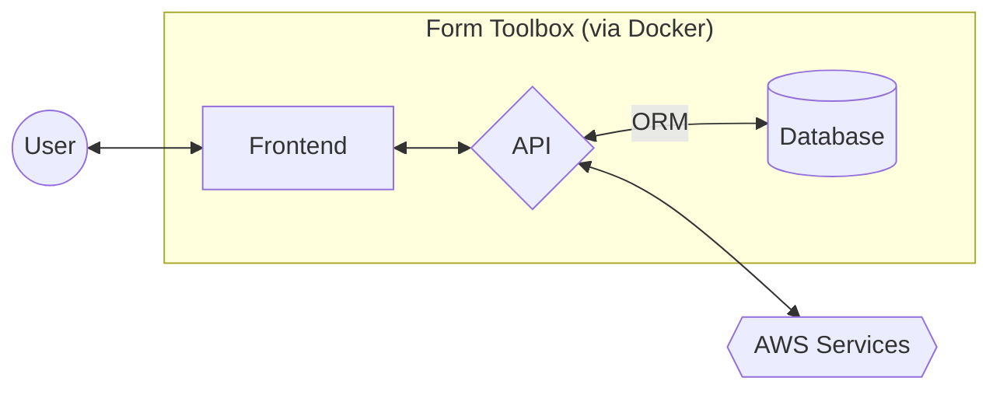
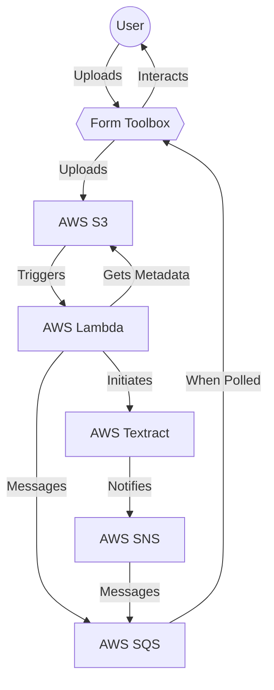
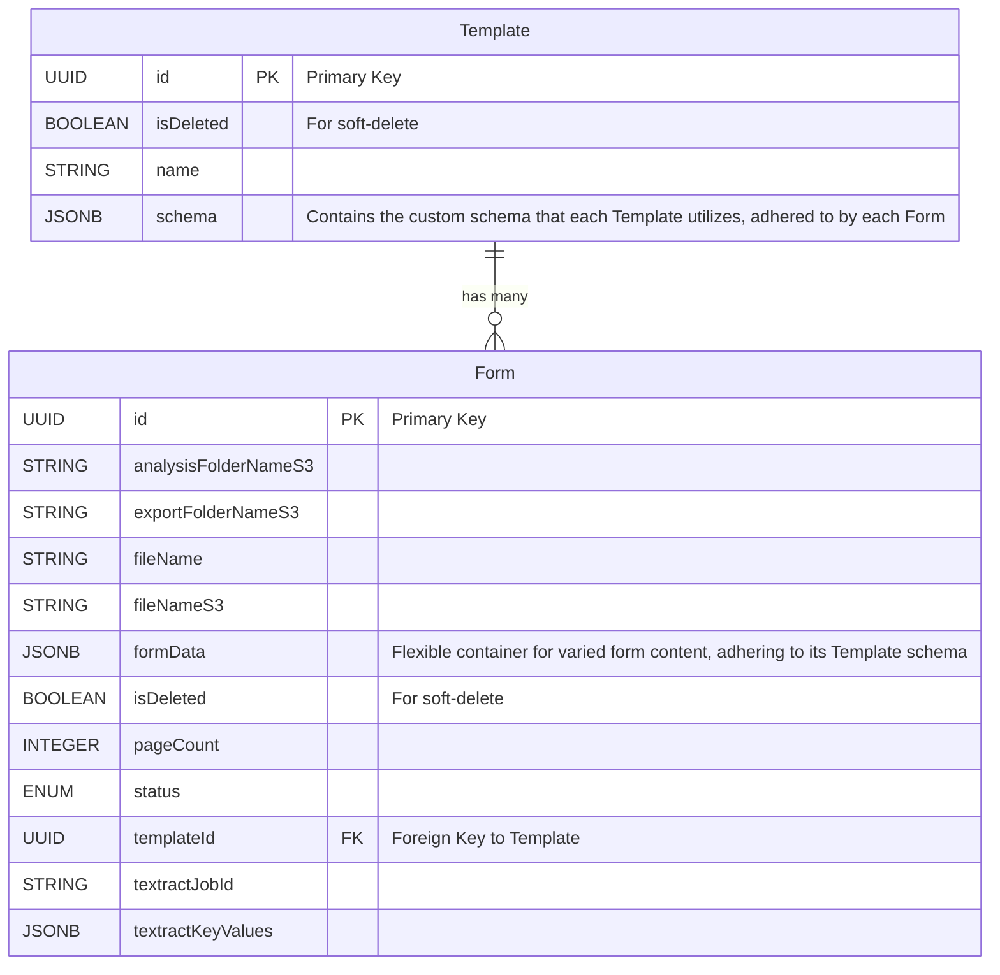
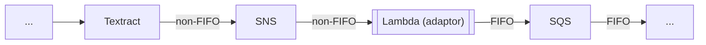

# form-toolbox

Form Toolbox simplifies and automates the process of entering and validating physical forms that have been digitized, saving time, increasing accuracy, and lowering business costs. Its architecture focuses on practicality and adaptability, using Docker containers for consistent and manageable deployment, Terraform for efficient and reliable orchestration of AWS resources, and AWS services to contextually extract data and securely store form artifacts and metadata. A unique namespace is utilized within Terraform to ensure that it can co-exist with other resources while also being easily identifiable.

In the future, Form Toolbox can be extended to provide contextual analysis, and verification of expected data.

## Screenshots



# Local Development

## Prerequisites

- AWS Account
- docker
- terraform cli

## Setting Up

To run a development build, which includes hot-reloading for the Docker portion:

1. Create `./terraform/terraform.tfvars`, populating `region`  with your AWS region
2. Run each following command from the `./terraform/` directory:
```
terraform init
terraform validate
terraform plan
terraform apply
```
3. Note outputted values from running `terraform apply` above:
```
AWS_BUCKET_NAME
AWS_REGION
AWS_SQS_QUEUE_NAME
COMPOSE_PROJECT_NAME
```
4. Create `./.env`, populating with above and appropriate values.
5. Run each following command:
```
docker compose build
docker compose up -d
```

## Tearing Down

When no longer needed, run each following command:

```
docker compose down
terraform destroy
```

# Notes

- `AWS_SQS_REQUEUE_DELAY` is in seconds
- `docker-compose.yaml` will eventually be renamed to `docker-compose-dev.yaml`, and `docker-compose.yaml` will be utilized for non-dev builds. This is to ease current development (requiring less typing) and architectural flexibilty.

# Application Architecture

Form Toolbox harnesses Docker for flexible and reliable deployment, and integrates with AWS for enhanced data processing and storage capabilities. The architecture weaves together modern web technologies and a highly-available and redundant backend framework to provide a seamless and performant user experience.

- **User**: Interacts with Form Toolbox to upload new forms and utilize resulting analysis.
- **Docker Environment**: Encapsulates the application components (Web Server, API, Database) in containers, facilitating consistent deployment and scalability.
- **Frontend - React with Hooks**: Serves as the frontend, handling user interactions and relaying requests to the API.
- **API - Node Express**: Backend server that processes requests, manages business logic, and interfaces with the database and AWS services.
- **ORM - Sequelize**: Facilitates communication between the API and the database, ensuring data consistency and simplifying database interactions.
- **Database - PostgreSQL**: Stores application data using PostgreSQL, leveraging Sequelize for object-relational mapping and incorporating JSONB for flexible schema representation.
- **AWS Services**: Provides cloud infrastructure for storage (S3), serverless computing (Lambda), form analysis (Textract), notifications (SNS), and message queuing (SQS).




# AWS Integration Diagram

Form Toolbox integrates AWS services, orchestrated through Terraform, to enhance form data processing and secure storage. This integration is pivotal in automating the extraction and analysis of key-value data from digitized forms.

- **User**: (see above)
- **Form Toolbox**: Acts as the central hub, including a frontend, API, and database. Receives form image from the user, initiates textraction, and polls AWS for raw analysis. Transforms analysis into contextual data.
- **AWS S3**: Stores forms, form thumbnails, metadata, and raw analysis. Triggers a Lambda function when new forms are uploaded.
- **AWS Lambda**: Retrieves metadata from S3 object, initiates Textract analysis, and informs SQS that analysis has started, including the related Textract ID.
- **AWS Textract**: Extracts key-value data from forms.
- **AWS SNS**: Notifies SQS when Textract has completed its analysis. Note that Textract cannot notify SQS directly.
- **AWS SQS**: Receives messages about the status of form processing, such as analysis start and completion. Form Toolbox polls the queue and then transforms the analysis.



*Note: within Mermaid markup, it does not appear possible at this time to render "AWS" as a subgraph and retain the intended flow/shape.*

# Database Diagram

To balance the diverse requirements of various templates (types of forms) with the need for strict schema and ACID compliance, Form Toolbox employs a hyrid approach. Utilizing PostgreSQL's JSONB datatype, each template has its own schema, while still maintaining a consistent, overarching schema-based system. This methodology effectively merges the benefits of NoSQL/Document storage – flexibility and adaptability – with the strengths of a SQL/Schema-based system – reliability and structure. The result is a system that provides consistent document-style storage and retrieval within a structured SQL framework, catering to diverse form requirements while upholding data integrity and consistency.



# Known Issues

- AWS `textract` does not appear to currently support FIFO-compatible notifications upon completion of a job. Therefore `SQS`, which subscribes to this `SNS` topic, is currently also non-FIFO. A solution may be to subscribe an adaptor `lambda` function to the non-FIFO `SNS` topic, which which then enqueues a FIFO-compatible message to the `SQS` queue, allowing `SQS` to be FIFO. See below example, noting that this approach may be overly complex.


- The `Upload complete!` toast is not always auto-closing after its timeout completes.
