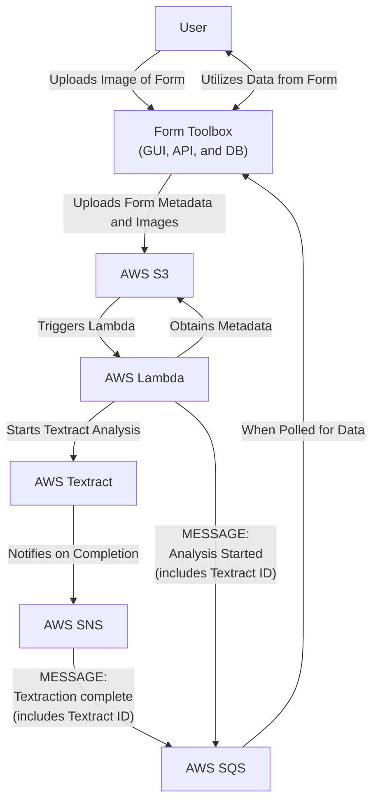

# form-toolbox

### Prerequisites

- AWS Account
- docker
- terraform

### 'Local' Development

To run a development build, which includes hot-reloading for the Docker portion:

1. `docker compose build`
2. `docker compose up -d`
3. `terraform -chdir=terraform validate`
4. `terraform -chdir=terraform plan`
5. `terraform -chdir=terraform apply`

When no longer needed, run:

1. `docker compose down`
2. `terraform -chdir=terraform destroy`

### Notes

- `AWS_SQS_REQUEUE_DELAY` is in seconds, not milliseconds
- `docker-compose.yaml` will eventually be renamed to `docker-compose-dev.yaml`. See `docker-compose.yaml` file for more details.

### AWS Integration Diagram

Form Toolbox utilizes AWS Textract to extract key-value data from forms.

