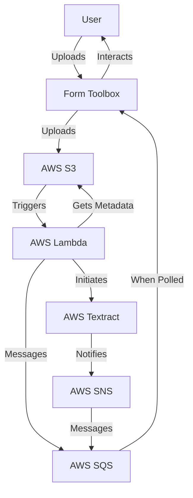
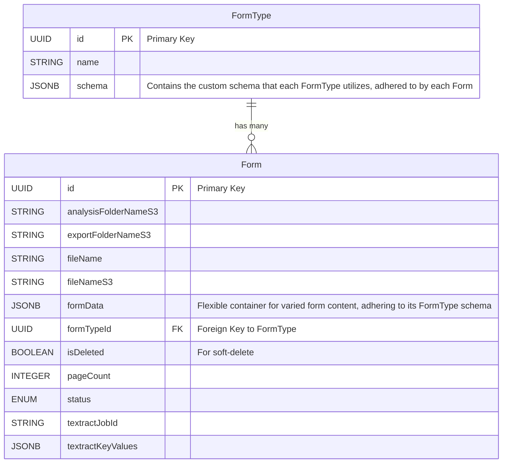

# form-toolbox

Assists the data-entry process by automating entry of form data. Can be extended to validate input against expected values.

# Prerequisites

- AWS Account
- docker
- terraform cli

# Local Development

## Setting Up

To run a development build, which includes hot-reloading for the Docker portion:

1. Create `./terraform/terraform.tfvars`, populating `region`  with your AWS region
2. Run each following command from the `./terraform/` directory:
```
terraform validate
terraform plan
terraform apply
```
3. Note outputted values from running `terraform apply` above:
```
AWS_BUCKET_NAME
AWS_REGION
AWS_SQS_QUEUE_NAME
COMPOSE_PROJECT_NAME
```
4. Create `./.env`, populating with above and appropriate values.
5. Run each following command:
```
docker compose build
docker compose up -d
``````

## Striking

When no longer needed, run each following command:

```
docker compose down
terraform destroy
```

# Notes

- `AWS_SQS_REQUEUE_DELAY` is in seconds
- `docker-compose.yaml` will eventually be renamed to `docker-compose-dev.yaml`, and `docker-compose.yaml` will be utilized for non-dev builds. This is to ease current development (requiring less typing) and architectural flexibilty.

# Known Issues

- `Warning: findDOMNode is deprecated in StrictMode` is caused by the `semantic-ui-react` library. Form Toolbox will be updated when an updated version becomes available.

# AWS Integration Diagram

Form Toolbox utilizes AWS Textract to extract key-value data from forms.

- **User**: Interacts with Form Toolbox to upload new forms and utilize resulting analysis.
- **Form Toolbox**: Acts as the central hub, including a frontend, API, and database. Receives form image from the user, initiates textraction, and polls AWS for raw analysis. Transforms analysis into contextual data.
- **AWS S3**: Stores forms, form thumbnails, metadata, and raw analysis. Triggers a Lambda function when new forms are uploaded.
- **AWS Lambda**: Retrieves metadata from S3 object, initiates Textract analysis, and informs SQS that analysis has started, including the related Textract ID.
- **AWS Textract**: Extracts key-value data from forms.
- **AWS SNS**: Notifies SQS when Textract has completed its analysis. Note that Textract cannot notify SQS directly.
- **AWS SQS**: Receives messages about the status of form processing, such as analysis start and completion. Form Toolbox polls the queue and then transforms the analysis.



# Database Diagram

To balance the diverse requirements of various form types with the need for strict schema and ACID compliance, Form Toolbox employs a hyrid approach. Utilizing PostgreSQL's JSONB datatype, we enable each form type to have its own schema, while still maintaining a consistent, overarching schema-based system. This methodology effectively merges the benefits of NoSQL/Document storage – flexibility and adaptability – with the strengths of a SQL/Schema-based system – reliability and structure. The result is a system that provides consistent document-style storage and retrieval within a structured SQL framework, catering to diverse form requirements while upholding data integrity and consistency.

